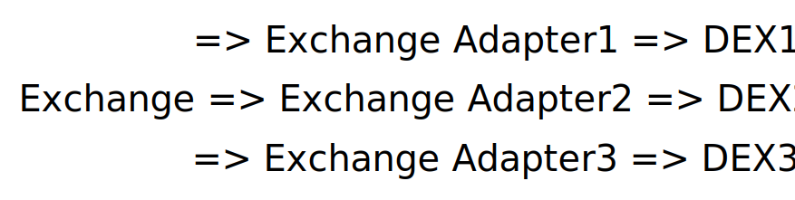

# Exchange

Exchange contract is factory that processing user swap with particular exchange adapter. In general exchange call looks like:



Each adapters has it's own realization of swap (depends on DEX interfaces) but all of them implement the same interface for factory.

To swap tokens through factory we should call method `swap()` of Exchange contract:

```solidity
function swap(
    string calldata aggregatorId,
    IERC20 tokenFrom,
    IERC20 tokenTo,
    uint256 amountFrom,
    uint256 amountTo,
    uint256 deadline,
    bool feeOnTransfer
) external payable;
```

Parameters:

*   `aggregatorId` - for now it's 3 possible options for this field:

    1. `SaucerSwap`
    2. `Pangolin`
    3. `HeliSwap`

    Choose the one which DEX you want to use for swap.
* `tokenFrom` and `tokenTo`. EVM address of token pair to swap. In case of swapping of the root token (HBAR) you need to provide zero address instead (`0x0000000000000000000000000000000000000000`) of token address. This option also allows to swap tokens to WHBAR of each exchange if necessary. Examples:

<table data-full-width="false"><thead><tr><th>Tokens to swap</th><th>tokenFrom</th><th>tokenTo</th></tr></thead><tbody><tr><td>Galaxy (CLXY) to HeadStarter(HST)</td><td>0x00000000000000000000000000000000000d1ea6</td><td>0x00000000000000000000000000000000000ec585</td></tr><tr><td>HBAR to HeadStarter(HST)</td><td>0x0000000000000000000000000000000000000000</td><td>0x00000000000000000000000000000000000ec585</td></tr><tr><td>HashTree(HASHTREE) to HBAR</td><td>0x0000000000000000000000000000000000163748</td><td>0x0000000000000000000000000000000000000000</td></tr><tr><td>HBAR to SaucerSwap WHBAR (WHBAR)</td><td>0x0000000000000000000000000000000000000000</td><td>0x0000000000000000000000000000000000163b5a</td></tr></tbody></table>


Each exchange has it's own WHBAR token to have ability to work with HBAR as ERC-20 token. If you need specific WHBAR - make sure you choose the right token address.


* `amountFrom` and `amountTo`. Amounts of tokens to swap in coins. Each token has different amount of decimals, for example if you want to swap 1 GRELF to your account, which has 8 decimals - you need to provide `amountFrom=100000000`.
* `deadline` - this is "rudiment" of porting DEXes from ethereum network, because on ethereum transactions can wait large amount of time before execution (with different gas strategy). On Hedera most of all transactions processed in 4 seconds. Value of this field should be 10 digits timestamp. Just make sure this timestamp > current date. For example on Javascript you can use this snippet to calculate `deadline`:

```javascript
const deadline = Math.floor(Date.now() / 1000) + 1000;
```

* `feeOnTransfer`. This parameter regulate which token to apply slippage. If you want to apply slippage to tokenTo (it means you swap exact amount of `tokenFrom` to variable amount of `tokenTo`) - you need to pass `false`, otherwise (it means you want to receive exact amount of `tokenTo` using variable amount of `tokenFrom` - pass `true`. If you want more explanation about AMM basics and slippage - proceed by this link: [https://academy.binance.com/en/articles/what-is-an-automated-market-maker-amm](https://academy.binance.com/en/articles/what-is-an-automated-market-maker-amm)


Also there is one more useful readonly function on Exchange smart-contract:

```solidity
function adapterFee(string calldata aggregatorId) external view returns (uint8 fee);
```

This function returns current EtaSwap fee for particular aggregator. Returned value dimension - is promille. For example if function return 1 - it means EtaSwap fee is 0.1%.
